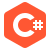

## Hi, I'm Elismar 👋 </h1>
---

  
  
  
  
  

- 🌱 I’m currently learning **back-end concepts and code patterns.**
- 👯 I’m looking to collaborate on **open-source projects.**
- 🤔 I’m looking for help with **front-end applications.**
 

#### :wrench: **Language and technologies**:

  
  
  
  
  

 

#### :chart_with_upwards_trend: My stats
 

<!--
**Elismar13/Elismar13** is a ✨ _special_ ✨ repository because its `README.md` (this file) appears on your GitHub profile.

Here are some ideas to get you started:

- 🔭 I’m currently working on ...
- 🌱 I’m currently learning ...
- 👯 I’m looking to collaborate on ...
- 🤔 I’m looking for help with ...
- 💬 Ask me about ...
- 📫 How to reach me: ...
- 😄 Pronouns: ...
- ⚡ Fun fact: ...
-->
